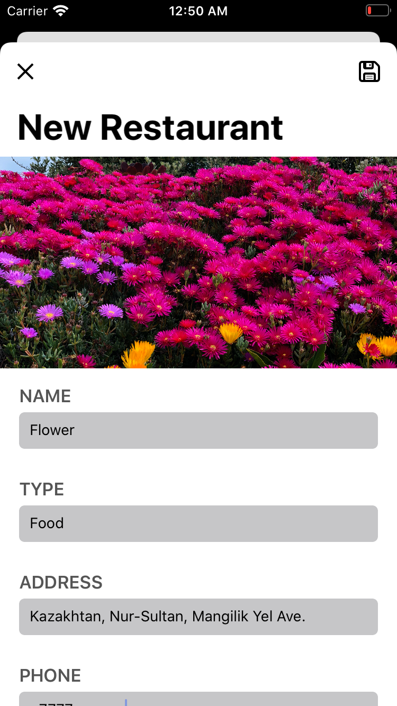

# FoodPin

This app was developed according to the book by Simon Ng, Beginning iOS 11 Programming with Swift.

This app has numerous capabilities and concepts:

* Multiple MVCs
* Animations
* CoreData
* CloudKit
* MapKit

## App breakdown

### Walkthrough screen

  
   
  

Walkthrough is needed to give user a brief idea of the app. This screen appears only once, as after pressing "Skip" button or reaching the last instruction a variable "hasViewedWalkthrough" in UserDefaults will be set to true.

For that screen a separate storyboard was created as well as sepearate controllers.

### Handling empty Table View

  

In order to fill the space of an empty table view a vector image is shown until there apears the first entry. You can add new entries by tapping "+" button.

### Adding new entry

  

Tapping "+" button segues a user to another Table View based screen, where usern can insert some data. Besides appearing on previous Table view, it is also being send to Public Cloud storage using CloudKit.

  

Previous table view with a new entry in it.

### Checking entry information

  
  

Every entry has its own local screen with all available data displayed in table. Tapping on a mini map at the bottom segues user to a full screen map. On the map if the address was found it is being marked with custom pin. Maps were added using MapKit.

## Other Tabs

All previous functionality was developed in "Favorites" tab. There are two more "About" and "Discover"

